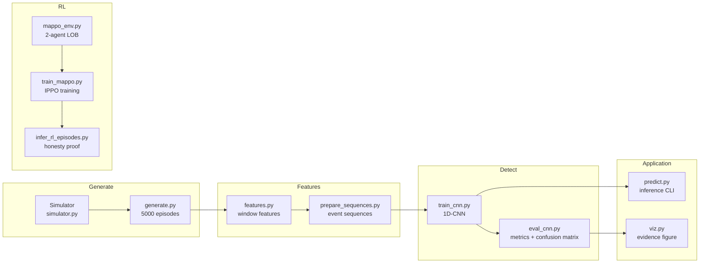

# Algorithmic Collusion Detector & MARL Sandbox

A complete pipeline for **detecting tacit collusion between autonomous trading bots** in simulated electronic markets. The system generates realistic limit-order-book episodes with four collusion modes (wash trading, tape painting, spoofing, mirror trading), trains a 1D-CNN classifier to detect them at the sub-minute level, and validates that independently-trained RL agents are correctly classified as honest.

---

## Pipeline



### Single Command

```bash
python run.py
```

This chains: CNN evaluation → MAPPO training → RL inference cross-check → visualization.

---

## Quick Start

### Inference (the application interface)

```bash
# Classify a single episode
python predict.py --orders dataset/orders/ep_00042.parquet \
                  --trades dataset/trades/ep_00042.parquet

# With CSV input (e.g. from C++ engine)
python predict.py --orders orders.csv --trades trades.csv --output predictions.csv
```

### Reproduce from scratch

```bash
pip install -r requirements.txt

# 1. Generate dataset (≈60 min, skip if dataset/ exists)
cd Simulator && python generate.py && cd ..

# 2. Extract features
cd data_prep && python features.py && cd ..

# 3. Pre-extract CNN sequences
cd data_prep && python prepare_sequences.py && cd ..

# 4. Train CNN detector (≈15 min on CPU)
cd detectors && python train_cnn.py && cd ..

# 5. Run full pipeline (eval + MAPPO + inference + viz)
python run.py
```

---

## Project Structure

```
AlgoCollusion Detector/
├── run.py                    # End-to-end pipeline orchestrator
├── predict.py                # Inference CLI — the application interface
├── viz.py                    # Evidence visualization
├── infer_rl_episodes.py      # RL ↔ detector cross-validation
├── requirements.txt
│
├── Simulator/
│   ├── simulator.py          # LOB + NoiseTrader + MarketMaker + ColluderPair
│   └── generate.py           # Dataset generation (5000 episodes)
│
├── data_prep/
│   ├── features.py           # Window-level feature extraction
│   └── prepare_sequences.py  # CNN event sequence encoding
│
├── detectors/
│   ├── train_cnn.py          # 1D-CNN training (5-class classifier)
│   ├── eval_cnn.py           # Test-set evaluation + confusion matrix PNG
│   └── cnn_best.pt           # Trained model checkpoint
│
├── rl_bots/
│   ├── market_env.py         # Single-agent Gymnasium environment
│   ├── ppo.py                # PPO implementation (actor-critic + GAE)
│   ├── train_rl.py           # Single-agent PPO training
│   ├── mappo_env.py          # Two-agent environment (shared LOB)
│   ├── train_mappo.py        # IPPO training (two independent PPO agents)
│   ├── ppo_best.pt           # Single-agent PPO checkpoint
│   └── mappo_episodes/       # Recorded MAPPO episodes for inference
│
├── cpp_engine/               # C++ LOB engine (approximate Python port)
│   ├── lob.{hpp,cpp}         # Limit order book
│   ├── participants.{hpp,cpp}# Trader agents
│   ├── simulation.{hpp,cpp}  # Episode runner
│   ├── main.cpp              # CLI driver
│   └── Makefile
│
└── dataset/                  # Generated data (5000 episodes)
    ├── labels.parquet
    ├── orders/ep_NNNNN.parquet
    ├── trades/ep_NNNNN.parquet
    ├── features.parquet
    ├── sequences.npy
    └── seq_index.parquet
```

---

## Collusion Types

The simulator generates four collusion schemes plus a baseline:

| Type | Description | Key Signal |
|------|-------------|------------|
| **none** | Honest market with noise traders only | No coordinated CA/CB activity |
| **wash** | A posts a limit, B crosses with a market order — inflates volume | High AB trade count, regular cadence |
| **paint** | A and B alternate buy/sell at mid — prints artificial price marks | Low inter-trade CV, tight price deviation |
| **spoof** | A stacks phantom limit orders, B trades the induced move, A cancels | High cancel burst, one-sided depth evaporation |
| **mirror** | A and B build symmetric depth on the same side, then cancel in sync | High sync-cancel ratio, same-side evaporation |

Each colluding episode has a random scheme window (60–300s) within a 600s episode. Windows outside the scheme period are labeled `none`, giving the detector both positive and negative examples from the same episode.

---

## Multi-Agent RL (IPPO)

Two independent PPO agents (`RL_A`, `RL_B`) trade in the same LOB alongside 13 noise traders and 1 market maker:

- **Each agent has its own actor network** mapping observations → action distribution
- **No shared critic** — this is IPPO (Independent PPO), not centralized MAPPO
- **Each agent sees only its own state** (position, cash, PnL) — no information about the other agent
- **Independent rewards** — pure PnL maximization, no collusion incentive
- **Training is centralized** (both agents train in the same process), **execution is decentralized** (each agent only uses its own policy)

The key result: after training, the CNN detector classifies all IPPO episodes as `none`, confirming no false positives on legitimate multi-agent trading.

---

## CNN Architecture

```
Input: (batch, 6, 200)  — 6-channel event sequence, 200 events per window

Conv1d(6→32, k=5) → BN → ReLU → MaxPool(2)     → 100
Dropout(0.2)
Conv1d(32→64, k=5) → BN → ReLU → AdaptiveMaxPool(1) → 64
FC(64→64) → ReLU → Dropout(0.3) → FC(64→5)

Parameters: ~25K
```

Per-event features (6 channels):
1. `normalized_ts` — event time normalized to [0, 1] within the window
2. `side` — +1 buy, -1 sell
3. `qty_normalized` — log1p(qty) / 6
4. `is_CA` — 1 if trader is CA, else 0
5. `is_limit` — order type
6. `is_market` — order type

---

## C++ Engine

The `cpp_engine/` directory contains a C++14 port of `simulator.py` for fast batch generation. It uses `std::mt19937_64` (vs Python's PCG64), so outputs are **statistically compatible but not bit-exact**. Use for speed-critical batch generation; the Python simulator is the reference implementation.

```bash
cd cpp_engine && make
./engine --mode smoke              # one episode per type
./engine --mode batch --episodes 100 --output cpp_dataset
```

---

## Dependencies

```
numpy>=1.24    pandas>=2.0     pyarrow>=12.0
torch>=2.0     scikit-learn>=1.3   gymnasium>=0.29
matplotlib>=3.7    seaborn>=0.12
```

Install: `pip install -r requirements.txt`

---

## License

Academic use. See individual source files for details.
